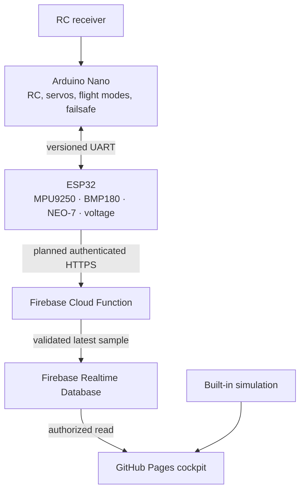

# FLIGHT COMMAND CENTER

**Advanced Flight Navigation, Telemetry & Mission Intelligence Platform**  
**NAVIGATE · MONITOR · COMMAND · ANALYZE**

[Repository](https://github.com/Turkson225/flight-command-center) · [Live dashboard](https://turkson225.github.io/flight-command-center/)

Flight Command Center is a browser cockpit for a custom fixed-wing aircraft whose Arduino Nano handles RC and flight-critical control while an ESP32 is planned to aggregate sensor and Nano state. The dashboard supports a **labeled simulation** and a Firebase Realtime Database cloud reader that can be configured for authenticated telemetry. It is useful for evaluating navigation displays, alert behavior, status clarity, and responsive layout before hardware integration.

> **Operational status:** The cloud reader and sign-in interface require a correctly provisioned Firebase project; selecting Cloud cannot turn simulated values into live aircraft readings. Hardware telemetry and the complete aircraft installation still require bench validation. Local browser flight recording is implemented, but there is no aircraft command path. Do not use these displays to operate an aircraft.

## Implemented milestone and roadmap

| Capability | This milestone | Integration still required |
| --- | --- | --- |
| Cockpit | Responsive primary flight display and aircraft attitude view (roll, pitch and heading), status, navigation/trail, battery, alerts and sensor-health presentation | Calibration and independent validation against actual flight instruments |
| Navigation map | Interactive OpenStreetMap basemap with aircraft, breadcrumb trail, reported HOME, home arrow, advisory geofence, return corridor and local grid fallback | Verified live GPS transport and a production tile service for higher traffic |
| Theme and layout | Midnight, monochrome, black-and-white and military themes; retractable navigation; persistent theme and customizable secondary command panels | — |
| Telemetry | Central typed state and a roughly 5 Hz deterministic simulation with selectable fault scenarios | ESP32 sensor drivers, UART decoding, calibrated sensor fusion and verified ingestion |
| Data source | Explicit simulation and optional Firebase Realtime Database cloud reader with source and freshness labeling; direct LAN remains unavailable | Configure a Firebase project, deploy and test secure device ingestion, connect hardware, and bench-test freshness and faults |
| Commands | Interface may show command/status concepts | Authorized, audited high-level commands with onboard acknowledgement and interlocks |
| Auth and history | Firebase email/password sign-in for restricted cloud reads; IndexedDB flight recording, synchronized replay, event markers, summaries, control-response screening and CSV/JSON export | Provision and validate owner/device access; define an external backup/retention policy if recordings must move between browsers |
| Hosting | Live GitHub Pages deployment from `main`, with Vite configured for `/flight-command-center/` | — |

The simulator includes normal flight, GPS failure, low battery, telemetry loss, and failsafe exercises. Values in a fault state must remain labeled as **simulated**; missing or stale values are not evidence of a safe aircraft state.

## Flight operations workspace

The **Flight operations** page records full telemetry samples in browser IndexedDB and replays the map, attitude model, surface commands and pitch traces against one scrubber. Completed flights include an annotated event timeline, post-flight summary, command/response correlation and lag screening, oscillation reversal frequency, and CSV/JSON downloads. Recordings stay on the current browser profile and are not written to Firebase or synchronized between devices.

Configurable pitch, bank, voltage, estimated battery, GPS, telemetry, failsafe and advisory-geofence rules run locally. The preflight checklist combines observable telemetry checks with explicit operator confirmations. These features support review and preparation; they do not enforce an aircraft flight envelope, verify mechanical condition, or determine airworthiness.

The attitude view currently follows **simulated** roll, pitch and heading. For live telemetry, the ESP32 must fuse calibrated MPU9250 gyroscope and accelerometer readings for roll/pitch and use the tilt-compensated, hard/soft-iron-calibrated magnetometer to bound yaw drift and derive magnetic heading. Magnetic heading differs from GPS course over ground, especially at low speed, in wind or during a turn. Source timestamps and sensor quality must accompany the live values; an invalid or stale attitude must be clearly marked rather than presented as current.

The geographic basemap loads standard OpenStreetMap tiles only for the area on screen. Its attribution stays visible. When tiles cannot load, the local coordinate grid remains available; this is not an offline map or terrain source. Tile service availability is best-effort. See the [OpenStreetMap tile policy](https://operations.osmfoundation.org/policies/tiles/). If real aircraft positions are added later, review the privacy implications of third-party map requests.

## Intended system architecture



The Nano must keep deterministic RC processing, actuator output, and onboard failsafe independent of the ESP32, Wi-Fi, the cloud, and this browser. The ESP32 is an observation and network gateway; GPS speed is **ground speed**, not airspeed. Battery remaining inferred from voltage is an estimate.

Details: [architecture and data flow](docs/architecture.md), [safety boundaries](docs/safety.md), [UART v1 specification](docs/uart-protocol.md), [cloud and direct integration](docs/cloud-integration.md).

## Run locally

Prerequisites: a current Node.js LTS and npm. From the repository root:

```bash
npm ci
cp .env.example .env.local
npm run dev
```

Open the address printed by Vite. The app is built under the `/flight-command-center/` base path; use the URL printed by the dev server rather than assuming `/`.

```bash
npm run build
npm run preview
```

Copy the Firebase web-app settings and aircraft ID into `.env.local` as shown in [cloud integration](docs/cloud-integration.md). In the dashboard, open **Telemetry**, sign in with an authorized owner account, and select **Cloud**. Until the Firebase project, rules, membership, trusted ingestion service and real ESP32 publisher are configured, Cloud shows no verified aircraft data. `VITE_` variables are embedded in browser JavaScript and are **not secrets**; keep device HMAC keys, Firebase Admin credentials, Wi-Fi passwords and database secrets out of the repo and out of Vite variables.

## GitHub Pages deployment

The production branch is `main`; the deploy workflow builds the site and publishes the `dist` artifact to GitHub Pages after successful checks. The repository's Pages source is configured for GitHub Actions. Push to `main` to trigger deployment, then check the Actions run and the [live dashboard](https://turkson225.github.io/flight-command-center/). The public Pages deployment remains in simulation until Firebase public build settings and backend resources are configured separately.

Vite's base path is `/flight-command-center/`. Static hosting does not provide server rewrites for arbitrary SPA routes; use the application's Pages-compatible navigation and verify a browser refresh on a nested screen. Never commit `.env.local` or put privileged keys in GitHub Actions build variables. See [deployment and connectivity](docs/cloud-integration.md).

## Hardware integration plan

| Component | Intended responsibility | Verification still needed |
| --- | --- | --- |
| Arduino Nano | Read RC receiver, generate control outputs, execute failsafe, report state over UART | RC link, actuator direction, endpoints, watchdog, failsafe under power and link faults |
| ESP32 | Parse UART; read MPU9250, BMP180, NEO-7, voltage sensor; send telemetry | Correct I²C/GPS wiring, calibration, fusion, ADC divider and reference, TLS, timing |
| Firebase backend | Authenticate devices at a trusted Cloud Function, validate samples, write RTDB, restrict reads with Firebase Auth and Security Rules | Project provisioning, per-aircraft membership tests, replay protection, ingestion deployment and retention |
| Browser | Display simulation or authenticated Firebase cloud samples with source and freshness; review recent local samples | Verified aircraft telemetry, stale/offline bench tests, independent validation |

The [UART protocol](docs/uart-protocol.md) is a proposed integration contract, not firmware tested on the aircraft. `firmware/` contains a transport reference and no flight-control sketch. `firebase/` contains RTDB rules and a trusted ingestion service that require a separately provisioned Firebase project. `supabase/` contains an earlier optional schema foundation; it is not used by the Firebase cloud reader or deployed by the frontend build.

## Project structure

```text
src/                 Browser application and simulation
public/              Static assets
docs/                Architecture, safety, protocol, connectivity
firmware/            UART transport reference (no aircraft control)
firebase/            Realtime Database rules and trusted ingestion service
supabase/migrations/ Earlier optional schema; not used by Firebase reader
.github/workflows/    Build and GitHub Pages deployment
```

## Safety and release conditions

No browser or cloud service may continuously drive ailerons, elevator, rudder, or throttle. A button click, queued command, network send, and aircraft acknowledgement are different states. On missing telemetry, preserve last known values with an age and stale/offline warning; never replace unknown sensor values with zeros. GPS fix, heading, sensor health, and readiness must come from validated observations.

Before any field use, complete the independent ground-test and failure-case checklist in [safety](docs/safety.md). This software is a development prototype, not a certified flight instrument or flight controller.

## Next steps

1. Implement and bench-test the Nano UART publisher and ESP32 parser against the same vectors in [UART v1](docs/uart-protocol.md).
2. Integrate calibrated sensors and actual source timestamps, with unavailable values represented as null and per-sensor health.
3. Set up Firebase Auth and Realtime Database, provision aircraft membership, deploy the trusted HTTPS ingestion service, and test cross-aircraft read denial and device replay rejection.
4. Connect the ESP32 publisher and verify real values, timing, sensor failures and disconnects on the bench; validate recordings and exported files against an independent reference before relying on post-flight analysis.
