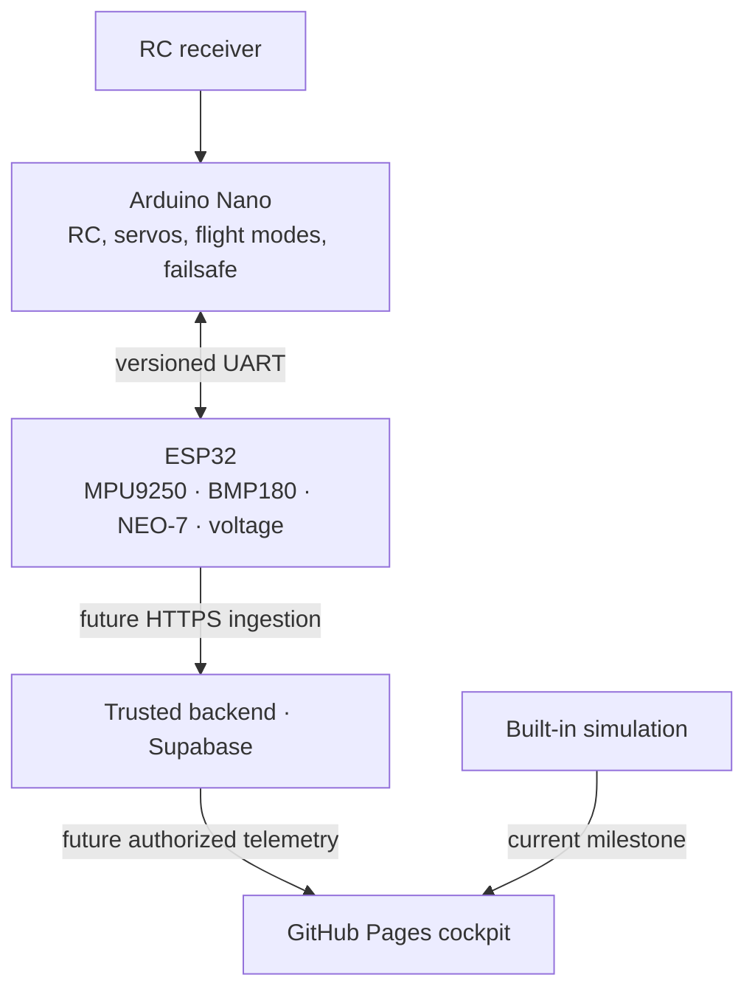

# FLIGHT COMMAND CENTER

**Advanced Flight Navigation, Telemetry & Mission Intelligence Platform**  
**NAVIGATE · MONITOR · COMMAND · ANALYZE**

[Repository](https://github.com/Turkson225/flight-command-center) · [Live dashboard](https://turkson225.github.io/flight-command-center/)

Flight Command Center is a browser cockpit for a custom fixed-wing aircraft whose Arduino Nano handles RC and flight-critical control while an ESP32 is planned to aggregate sensor and Nano state. This repository's first milestone is a **simulation-led interface**. It is useful for evaluating navigation displays, alert behavior, status clarity, and responsive layout before hardware integration.

> **Operational status:** Simulation data is synthetic and labeled. This milestone has no verified aircraft connection, sensor readings, cloud ingestion, authentication, persisted flight recording, or aircraft command path. Do not use its displays to operate an aircraft.

## Implemented milestone and roadmap

| Capability | This milestone | Integration still required |
| --- | --- | --- |
| Cockpit | Responsive primary flight display, status, navigation/trail, battery, alerts and sensor-health presentation | Calibration and independent validation against actual flight instruments |
| Navigation map | Interactive OpenStreetMap basemap with aircraft, reported HOME, trail and local grid fallback | Verified live GPS transport and a production tile service for higher traffic |
| Theme | Light and dark themes with a persistent operator preference | — |
| Telemetry | Central typed state and a roughly 5 Hz deterministic simulation with selectable fault scenarios | ESP32 sensor drivers, UART decoding, secure ingestion and live telemetry adapter |
| Data source | Explicit simulation, cloud/direct unavailable states | Cloud and direct adapters with connectivity and freshness tests |
| Commands | Interface may show command/status concepts | Authorized, audited high-level commands with onboard acknowledgement and interlocks |
| History/auth | Product design and optional schema foundation | Backend deployment, RLS verification, Supabase Auth, flight recorder, replay and analytics |
| Hosting | Live GitHub Pages deployment from `main`, with Vite configured for `/flight-command-center/` | — |

The simulator includes normal flight, GPS failure, low battery, telemetry loss, and failsafe exercises. Values in a fault state must remain labeled as **simulated**; missing or stale values are not evidence of a safe aircraft state.

The geographic basemap loads standard OpenStreetMap tiles only for the area on screen. Its attribution stays visible. When tiles cannot load, the local coordinate grid remains available; this is not an offline map or terrain source. Tile service availability is best-effort. See the [OpenStreetMap tile policy](https://operations.osmfoundation.org/policies/tiles/). If real aircraft positions are added later, review the privacy implications of third-party map requests.

## Intended system architecture



The Nano must keep deterministic RC processing, actuator output, and onboard failsafe independent of the ESP32, Wi-Fi, the cloud, and this browser. The ESP32 is an observation and network gateway; GPS speed is **ground speed**, not airspeed. Battery remaining inferred from voltage is an estimate.

Details: [architecture and data flow](docs/architecture.md), [safety boundaries](docs/safety.md), [UART v1 specification](docs/uart-protocol.md), [cloud and direct integration](docs/cloud-integration.md).

## Run locally

Prerequisites: a current Node.js LTS and npm. From the repository root:

```bash
npm ci
cp .env.example .env.local
npm run dev
```

Open the address printed by Vite. The app is built under the `/flight-command-center/` base path; use the URL printed by the dev server rather than assuming `/`.

```bash
npm run build
npm run preview
```

The `.env.example` values document future public build settings. `VITE_` variables are embedded in browser JavaScript and are **not secrets**. Configuring a Supabase URL or public anon key alone does not turn on live telemetry. Keep service-role keys, device credentials, Wi-Fi credentials, and database passwords out of the repo and out of Vite variables.

## GitHub Pages deployment

The production branch is `main`; the deploy workflow builds the site and publishes the `dist` artifact to GitHub Pages after successful checks. The repository's Pages source is configured for GitHub Actions. Push to `main` to trigger deployment, then check the Actions run and the [live dashboard](https://turkson225.github.io/flight-command-center/).

Vite's base path is `/flight-command-center/`. Static hosting does not provide server rewrites for arbitrary SPA routes; use the application's Pages-compatible navigation and verify a browser refresh on a nested screen. Never commit `.env.local` or put privileged keys in GitHub Actions build variables. See [deployment and connectivity](docs/cloud-integration.md).

## Hardware integration plan

| Component | Intended responsibility | Verification still needed |
| --- | --- | --- |
| Arduino Nano | Read RC receiver, generate control outputs, execute failsafe, report state over UART | RC link, actuator direction, endpoints, watchdog, failsafe under power and link faults |
| ESP32 | Parse UART; read MPU9250, BMP180, NEO-7, voltage sensor; send telemetry | Correct I²C/GPS wiring, calibration, fusion, ADC divider and reference, TLS, timing |
| Backend | Authenticate devices, validate and store samples, fan out read access | Provisioning, per-aircraft authorization, replay protection, RLS tests, retention |
| Browser | Display source and freshness; review flights | Real adapter, stale/offline behavior, independent validation |

The [UART protocol](docs/uart-protocol.md) is a proposed integration contract, not firmware tested on the aircraft. `firmware/` contains a transport reference and no flight-control sketch. `supabase/` contains an optional schema foundation; it is not deployed by the frontend build.

## Project structure

```text
src/                 Browser application and simulation
public/              Static assets
docs/                Architecture, safety, protocol, connectivity
firmware/            UART transport reference (no aircraft control)
supabase/migrations/ Optional database foundation
.github/workflows/    Build and GitHub Pages deployment
```

## Safety and release conditions

No browser or cloud service may continuously drive ailerons, elevator, rudder, or throttle. A button click, queued command, network send, and aircraft acknowledgement are different states. On missing telemetry, preserve last known values with an age and stale/offline warning; never replace unknown sensor values with zeros. GPS fix, heading, sensor health, and readiness must come from validated observations.

Before any field use, complete the independent ground-test and failure-case checklist in [safety](docs/safety.md). This software is a development prototype, not a certified flight instrument or flight controller.

## Next steps

1. Implement and bench-test the Nano UART publisher and ESP32 parser against the same vectors in [UART v1](docs/uart-protocol.md).
2. Integrate calibrated sensors and actual source timestamps, with unavailable values represented as null and per-sensor health.
3. Deploy a trusted HTTPS ingestion service, configure per-device credentials, and connect the browser cloud adapter to authorized reads.
4. Add user authentication, RLS tests, recording/replay, audit history, and high-level command state only after end-to-end hardware confirmation.
