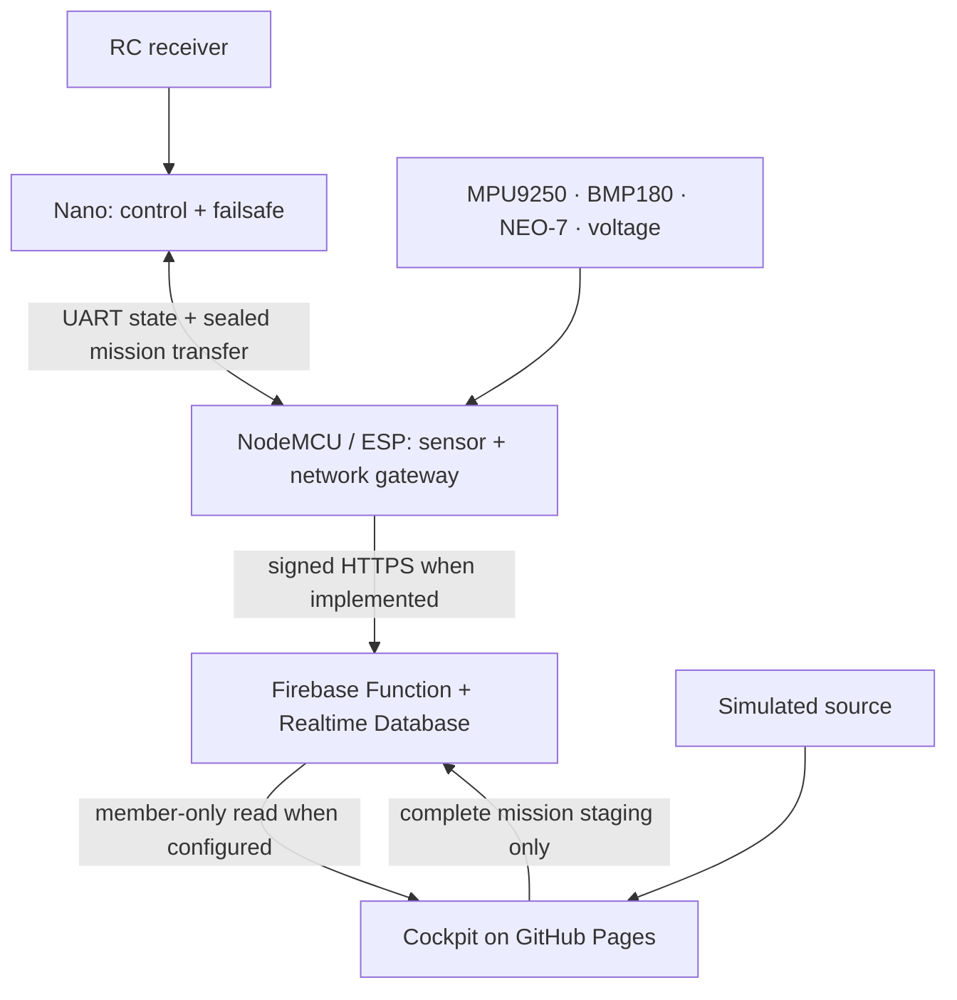

# System architecture and telemetry contract

## Control and observation

The Arduino Nano is the only controller responsible for time-sensitive aircraft behavior: RC link processing, servo and ESC signals, mode rules, onboard navigation, and failsafe. The NodeMCU/ESP gateway reads Nano state via UART, receives navigation/sensor inputs, forwards validated telemetry, and may relay a complete staged mission. The browser observes telemetry and prepares mission packages; it does not stream steering. Losing power or connectivity to the gateway, backend, or browser must not change the Nano's ability to navigate locally or apply its onboard failsafe.

## Telemetry source state

The browser model carries an explicit source (`simulation`, `cloud`, `direct`, `offline`), receipt timestamp for Firebase cloud samples, and validity/health per measurement. Cloud subscribes to the configured Firebase aircraft node after owner sign-in; direct has no adapter. Selecting an unavailable source must never quietly switch to simulation and label synthetic values live.

| Field | Producer | Units / interpretation | Invalid state |
| --- | --- | --- | --- |
| Roll and pitch | Calibrated MPU9250 gyro + accelerometer fusion on ESP32 | Degrees; aircraft attitude, with mounting alignment and filter validation | `null` with stale/error health |
| Yaw / magnetic heading | Calibrated MPU9250 gyro + tilt-compensated magnetometer fusion on ESP32 | Degrees; heading normalized to [0, 360), referenced to magnetic north unless declination correction is applied | `null` with stale/error health |
| GPS latitude, longitude, fix, satellites, HDOP | NEO-7 | WGS84 degrees; boolean fix; count; dimensionless HDOP | Coordinates `null` when no valid fix |
| GPS ground speed and course | NEO-7 | km/h and degrees in the browser model; convert raw GPS or stored m/s at the adapter boundary; **not airspeed** | `null` without valid position/velocity |
| Pressure, temperature, barometric altitude | BMP180 | hPa, °C, metres; altitude relative to configured reference | `null` if unavailable |
| Battery voltage | Calibrated ADC divider on ESP32 | Volts at aircraft battery; percent is estimate requiring battery profile | `null` on ADC fault |
| Throttle, control axes, mode, RC and failsafe state | Nano UART v1 | Normalized demand and actual reported mode | Stale when UART stops; never infer servo feedback |

The data model should distinguish raw measurements, derived navigation outputs, and source/quality metadata. A stale reading can remain visible as last known, but must show its age and stale state. A missing value is not zero. Sensor-specific failure does not imply all other sensors failed.

The aircraft attitude view should consume roll and pitch from the fused IMU solution and a separately labeled magnetic heading. Hard-iron and soft-iron magnetometer calibration, tilt compensation, sensor mounting alignment, and magnetic interference checks are required before heading can be trusted. The gyroscope's integrated yaw drifts without an external reference; a magnetometer can constrain it only when its quality is acceptable. Keep GPS course over ground separate from heading: course describes movement and may be unavailable or noisy when nearly stationary. Attach a source timestamp and per-output validity/quality so the view can hold a last-known pose with an explicit age and stale indication. The current browser renders simulated values; live ESP32 fusion and transport remain future integration work.

## Frequency, freshness and storage

- Target Nano state packet rate: 10 Hz during later bench validation; this is a design target rather than a verified rate.
- Target visual updates: around 5–10 Hz when actual telemetry supports them; animation between packets does not create new measurements.
- Historical samples: the browser retains a bounded live chart buffer in memory. When the operator starts a recording, full typed samples and event markers are collected separately and a completed flight is saved to browser IndexedDB. Recordings are local to that browser profile, are not cloud backups, and need an external retention policy if they must survive device loss or be shared.
- Use monotonic clock time for local packet age; source `uptime_ms` is not synchronized with browser, ESP32, or UTC clocks.
- Device and backend should attach a trusted receipt timestamp. Capture GPS UTC where available, but do not use an unverified device clock as proof of freshness.
- An alert needs state (`active`, `acknowledged`, `resolved`), severity, source, timestamps, and a testable threshold with hysteresis. Acknowledging a UI alert is not resolving an aircraft fault.
- Current configurable warnings and preflight checks are browser-side advisory logic. They neither enforce limits onboard nor prove readiness. Automatic flight events are retained with local recordings; the backend does not yet provide an authoritative audit log.

## Navigation semantics

Set home only after a valid GPS fix and a deliberate rule or operator action. Home coordinates, distance and bearing become unavailable when home or fix is absent. GPS speed is ground speed. Vertical speed from filtered barometric altitude is an estimate, not a direct BMP180 measurement. The dashboard must not imply true airspeed, wind, geofence enforcement, autonomous waypoint flight, or actual servo positions until those are instrumented and implemented onboard.

## Proposed trust boundaries

The Nano's control loop trusts only its verified RC and onboard inputs. It must independently validate a complete mission before persistent storage and must never start it on receipt. The gateway should reject malformed UART, sensor and mission data before onward transport. Telemetry ingestion should authenticate the aircraft and validate timestamps, ranges, sequence and rate limits; the browser should only access aircraft allowed by its authenticated role. See [mission planning](mission-planner.md), [cloud integration](cloud-integration.md) and [safety](safety.md).

## Milestone status

Current delivery includes the browser simulation, an optional authenticated Firebase reader, and deployable Firebase rules and ingestion code. A Firebase project, credentials and real device publisher have not been configured. This document does not assert that wiring, calibration, UART exchange, sensor fusion, cloud ingestion, or flight behavior has been field tested.
