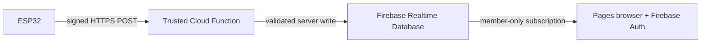

# Firebase cloud connectivity and deployment

## Current state

The GitHub Pages frontend is a static site. It includes a labeled simulation and an optional Firebase Realtime Database reader with Firebase Authentication sign-in. **No Firebase project, owner account, aircraft membership, device credential, Cloud Function, or real ESP32 telemetry has been configured for this installation.** The cloud reader alone does not connect an aircraft, write samples, record a flight, or authorize web flight control. Cloud mode should show an unconfigured, sign-in, waiting, or error state until all relevant pieces exist; it must never quietly substitute simulation values.

The earlier optional SQL in [`supabase/migrations`](../supabase/README.md) remains in the repository as a separate, unused design artifact. It is not part of this Firebase path and is not applied by the Pages build.

## Data path and trust boundaries



The Nano remains responsible for RC processing, actuator outputs, and onboard failsafe. The ESP32 is an observation gateway. A Wi-Fi, Firebase or browser outage must not change the Nano's ability to apply its failsafe. There is no continuous browser-to-servo control path.

The latest-value node is `/aircraft/{aircraftId}/telemetry/latest`. This abbreviated illustration omits the required nested fields in `sample`:

```json
{
  "schemaVersion": 1,
  "receivedAt": 1780000000000,
  "sample": { "aircraftId": "FD-X1", "timestamp": 1780000000000 }
}
```

Here `sample` follows the typed [`AircraftTelemetry`](../src/core/telemetry.ts) model, with nullable unknown measurements and per-sensor health. `sample.timestamp` is the claimed capture time; `receivedAt` is written by the trusted server in Unix milliseconds. Neither a stale source reading nor an old RTDB cache value proves a current link. The browser must use freshness and connectivity checks and label any retained pose or GPS coordinates **last known**. GPS ground speed is km/h in the browser model; magnetic heading is separate from GPS course. Source calibration and validation remain required before either is trusted.

## Configure a development Firebase project

1. [Create a Firebase project](https://firebase.google.com/docs/projects/learn-more) and register a **Web app**. In **Build → Realtime Database**, create the **default database** in **locked mode** and copy its exact `databaseURL`, including its regional host. Do not use permissive test-mode rules for this aircraft project.
2. In **Authentication → Sign-in method**, enable **Email/Password**. Create an owner account with an address you control and record its Firebase Authentication UID. Firebase web configuration identifies the project; it does not authorize database access by itself.
3. Review and deploy [`firebase/database.rules.json`](../firebase/database.rules.json), then provision `/memberships/{ownerUid}/aircraft/FD-X1 = true` from a trusted Admin SDK/Console path. Match `FD-X1` to the configured aircraft ID. This boolean membership grants read access; it is not an `OWNER` role field, so provision only accounts you intend to authorize. The rules allow an authenticated member to read the matching aircraft's telemetry and their own membership; they deny browser writes. Test unauthenticated, owner, unrelated account, revoked membership and cross-aircraft reads before accepting real data. Detailed CLI steps are in [`firebase/README.md`](../firebase/README.md).
4. Copy `.env.example` to `.env.local` for a local build and set the following **public web-app values** from Firebase project settings:

   ```dotenv
   VITE_FIREBASE_API_KEY=your_web_api_key
   VITE_FIREBASE_AUTH_DOMAIN=your_project.firebaseapp.com
   VITE_FIREBASE_DATABASE_URL=https://your_database_host/
   VITE_FIREBASE_PROJECT_ID=your_project_id
   VITE_FIREBASE_APP_ID=your_web_app_id
   VITE_FIREBASE_AIRCRAFT_ID=FD-X1
   ```

5. Run `npm ci && npm run dev`, open **Telemetry**, sign in with the owner email and password, and choose **Cloud**. Without a valid trusted sample, the display remains empty or waiting; that is expected. Selecting **Simulation** explicitly returns to synthetic data.
6. For the GitHub Pages build, set the same six `VITE_FIREBASE_*` values in the repository's **Settings → Secrets and variables → Actions → Variables**, then rerun the Pages workflow. The workflow embeds these public values at build time. Do not put an owner password, Firebase Admin credentials or a device HMAC key in repository variables or any `VITE_` setting.

Firebase Realtime Database [web setup](https://firebase.google.com/docs/database/web/start), [Security Rules](https://firebase.google.com/docs/database/security/), and [password sign-in](https://firebase.google.com/docs/auth/web/password-auth) explain the console steps. A web API key is a project identifier, not a database password; the authenticated user and deployed Security Rules enforce read access. Add the Pages domain as an authorized Auth domain if the Firebase console requires it.

## Trusted ESP32 ingestion

The browser has **read-only** database access. The ESP32 should send bounded, versioned JSON over certificate-verified HTTPS to the trusted `ingestTelemetry` Cloud Function in [`firebase/functions`](../firebase/functions/). The function authenticates the device with a per-device HMAC secret, checks freshness and replay state, validates aircraft identity and sensor ranges, and attaches `receivedAt` before writing the latest sample with Firebase Admin SDK. The device sends `{schemaVersion:1,sample:<full AircraftTelemetry>}` with `X-FCC-Device-Id`, `X-FCC-Timestamp` and `X-FCC-Signature` headers. The timestamp must be within 15 seconds of the server clock and the captured sample within five seconds of the signed request; consecutive accepted requests must be at least 150 ms apart. The exact signature byte sequence, device provisioning and deployment commands are in [`firebase/README.md`](../firebase/README.md).

The device secret belongs in trusted device storage and the server's Secret Manager configuration, never in the Pages bundle, RTDB client rules, or this repository. Deploying Cloud Functions requires the billing-enabled Blaze plan; review the [Firebase pricing plans](https://firebase.google.com/docs/projects/billing/firebase-pricing-plans) before enabling it.

Use NTP or another valid clock source before ESP32 TLS connections; do not use `setInsecure()` in a deployed gateway. If connectivity fails, drop samples that have aged outside the ingestion window and resume with a current reading rather than replaying stale flight values. Revalidate on receipt and distinguish capture time from server receipt time. Device provisioning, secret rotation/revocation, ingestion rate, retention and field testing are separate deployment work. Applying the RTDB rules or entering web config alone will not publish sensor data.

## Direct LAN mode

Direct ESP32 LAN mode remains unimplemented. An HTTPS GitHub Pages document generally cannot open an insecure `http://` or `ws://192.168.x.x` endpoint due to mixed content and browser private-network restrictions; CORS and routing add constraints. A field design needs deliberate testing of a local-origin cockpit or trusted HTTPS/WSS bridge with explicit authorization. Do not disable browser security to make direct telemetry appear to work. Even a local source must show sample age and a disconnected state.

## GitHub Pages

The production branch is `main`; the deploy workflow builds `dist` and publishes it with GitHub Actions. Vite uses `/flight-command-center/` as the base path. Hash-based navigation supports refreshes on static Pages hosting. Visit the [deployed dashboard](https://turkson225.github.io/flight-command-center/) after a successful workflow run, verify its assets, and check the source banner. A successful Pages release proves that static assets were deployed; it does not prove Firebase rules, ESP32 ingestion, GPS, sensor fusion or an aircraft command path is online.
